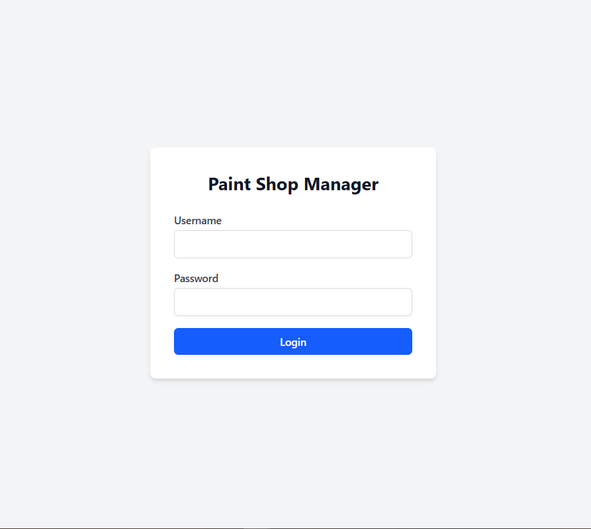
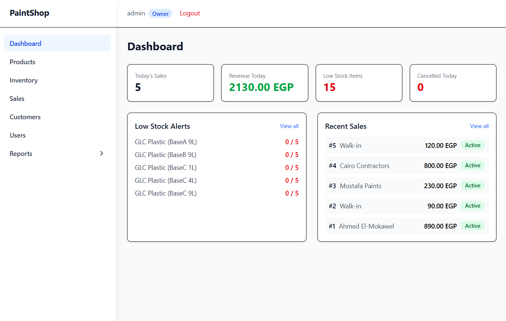
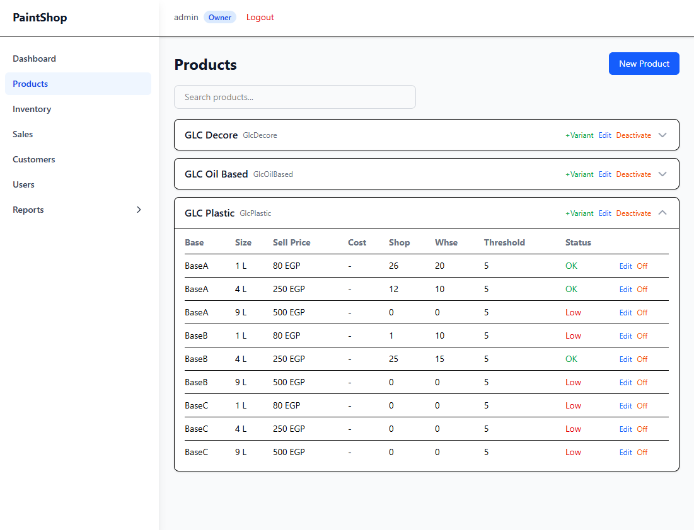
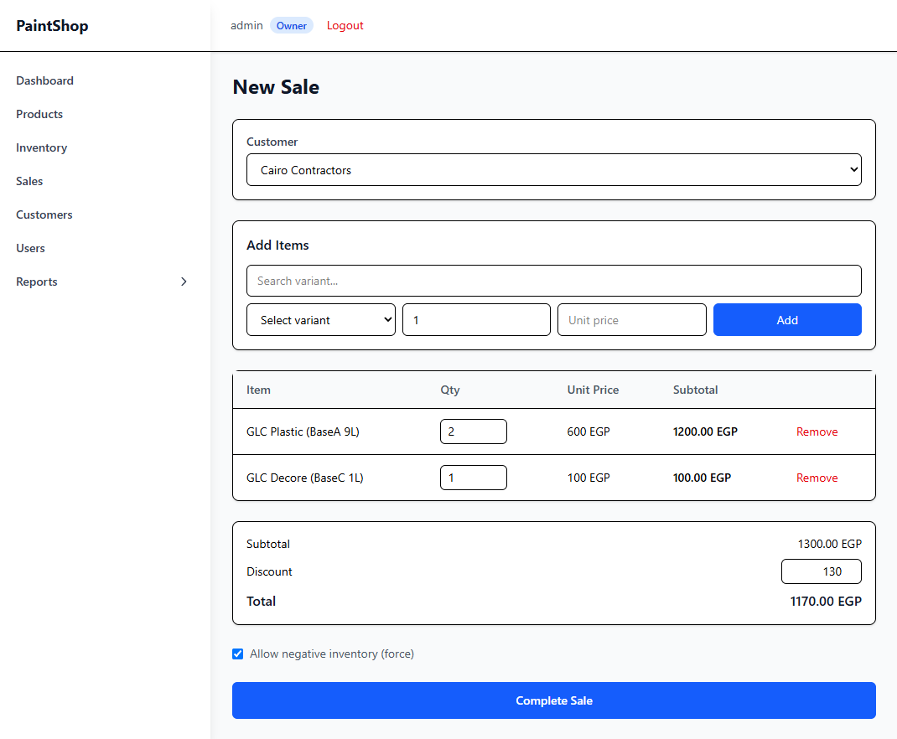
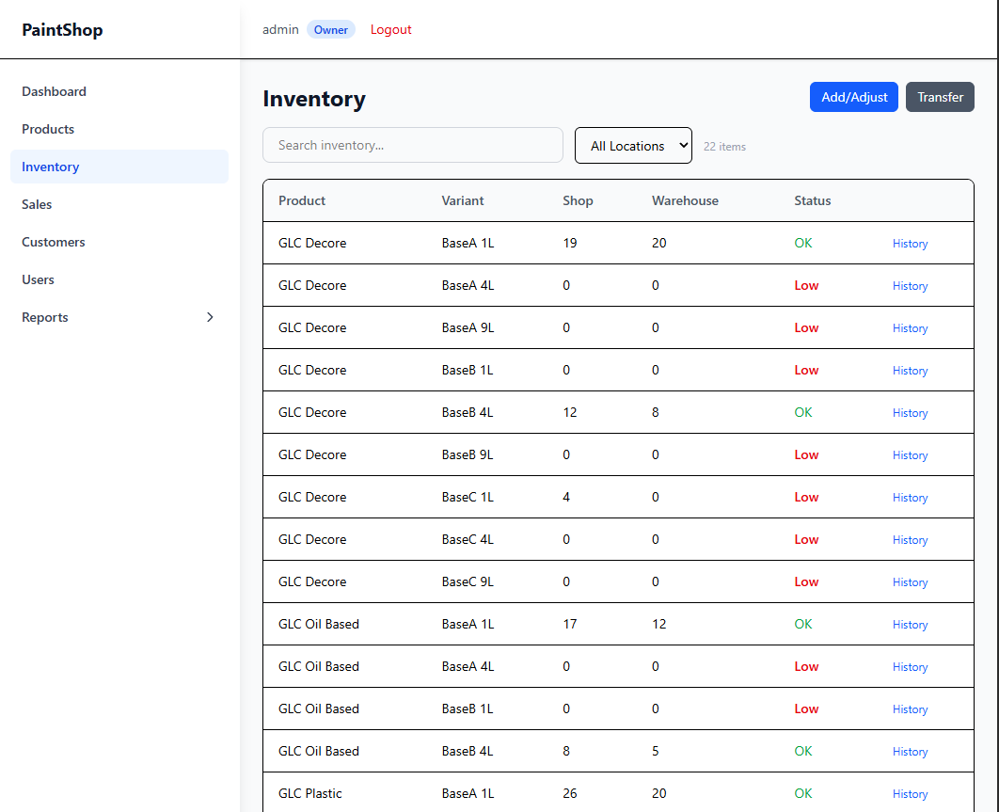
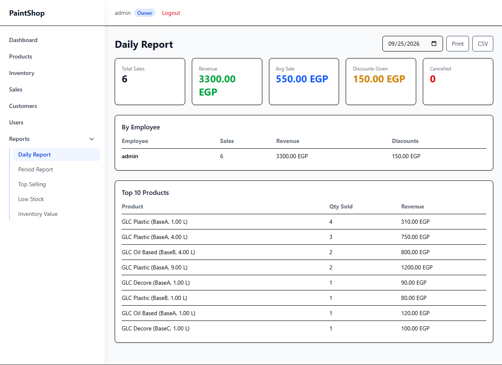

# 🎨 Paint Shop Manager

> A production-ready Paint Shop Management System built with **ASP.NET Core 9**, **React 19**, and **Clean Architecture**, inspired by 5 years behind a GLC paints tinting counter.

<p align="center">

[🌐 Live](https://paint-shop-black.vercel.app)
•
[📚 Engineering Case Study](docs/ENGINEERING.md)

</p>

---


---

## 📸 Preview

> Screenshots coming soon — the live demo below is fully working.

| Login | Dashboard | Products |
|-------|-----------|----------|
|  |  |  |

| Create Sale | Inventory | Reports |
|-------------|-----------|---------|
|  |  |  |

---

# Why This Project?

I spent **5 years as a salesman in a GLC paints branch** — tinting and mixing colors at the counter, selling to contractors and walk-in customers, managing Shop and Warehouse stocks, and preparing daily sales reports for the owners.

Instead of building another generic CRUD app, I modeled the real workflow of a paint shop: a customer asks for a tinted color, you mix the right base and size, check Shop stock (not Warehouse), apply a discount, print the invoice — and the owner reviews it all in the evening report.

Every domain concept in this system maps to something I did daily:

| Shop counter reality | System concept |
|---|---|
| Tinting bases (BaseA/B/C, White, Silver, Gold) | `BaseType` enum on every variant |
| 1L / 4L / 9L cans, per-line price deals | Variants with snapshotted `OriginalPrice` vs charged `UnitPrice` |
| "Do we have it in the Shop?" (Warehouse doesn't count) | Shop-only stock deduction + low-stock alerts |
| Selling before stock arrives | `ForceNegativeInventory` with warning flags |
| Cancelled sale = paint goes back on the shelf | Cancellation restores stock with audit trail |
| Evening report for the owner | Daily / period / top-selling / valuation reports with CSV + print |

The goal was to combine **real paint-trade domain knowledge** with modern software engineering practices — the same approach as my [HotelManager](https://github.com/A7medMubarak) project, which came from my hotel receptionist experience.

---

# Live Demo

| Service | Link |
|---------|------|
| Frontend | https://paint-shop-black.vercel.app |
| Backend API | https://paintshop.runasp.net |

**Demo login** — Username: `admin` · Password: `admin123` (Owner role, full access)

---

# Key Features

## Paint Products & Variants

- Product catalog (GLC Plastic, GLC Decore, GLC Oil-Based)
- Variants by base type, size value/unit, selling & cost price
- Per-variant low-stock thresholds
- Activate / deactivate without deleting history
- New variants auto-provision Shop + Warehouse stock rows

## Two-Location Inventory

- Separate Shop (point-of-sale) and Warehouse tracking per variant
- Add / adjust / transfer stock with full movement history
- Low-stock alerts computed on Shop stock only
- Every change recorded as an auditable `StockMovement`

## Sales & Discounts

- POS-style sale creation with customer, line items, invoice-level discount
- Per-line discount tracking (`OriginalPrice` snapshot vs `UnitPrice`)
- Color code per line (the tinted shade actually sold)
- Force-negative-inventory override with warning flags
- Cancellation restores stock and writes audit movements (Owner only)

## Customers & Invoicing

- Customer CRUD with purchase history
- Walk-in default customer for quick cash sales
- Server-generated printable HTML invoices

## Reports & Analytics

- Daily, period, top-selling, low-stock, inventory valuation reports
- Revenue excludes cancelled sales; discounts tracked per employee
- CSV export + browser print on every report

## Users & Access Control

- Owner / Employee roles, BCrypt-hashed passwords
- Owner password reset (no current password needed), self-service change
- Deactivation blocks login; last active Owner is protected

---

## Business Rules

- Sales deduct from **Shop only** — Warehouse is storage, never sold from
- Low stock = Shop quantity below variant (or system default) threshold
- Discounts validated: invoice total can never go negative
- Duplicate line items auto-aggregated per variant
- Inactive variants cannot be sold
- Double-cancellation rejected
- Empty search queries return `[]`, never 500

---

## Security

- JWT Authentication (24h) with Owner/Employee role authorization
- BCrypt password hashing + complexity policy (8+, upper/lower/digit)
- 14 FluentValidation validators, auto-applied to every request
- Global exception handler → RFC 7807 ProblemDetails
- Invoice HTML-encoding against stored XSS
- No secrets in git: prod config via environment variables only

---

## User Experience

- Dashboard with today's sales, revenue, low-stock alerts, recent sales
- Server-side pagination + search on every list
- Responsive Tailwind UI with toast notifications
- CSV export and print support across reports

---

# Technology Stack

## Backend

- ASP.NET Core 9
- Entity Framework Core 9 (code-first, migrations auto-apply)
- SQL Server
- FluentValidation 11
- JWT Bearer + BCrypt.Net
- xUnit + Moq + FluentAssertions + EF Core InMemory (99 tests)

## Frontend

- React 19
- TypeScript
- Vite 8
- Tailwind CSS 4
- Axios-style fetch client
- React Router

## DevOps

- GitHub Actions (test gate → publish → WebDeploy sync)
- MonsterASP.NET (API + SQL Server)
- Vercel (SPA)

---

# Architecture

The solution follows **Clean Architecture** to separate business rules from infrastructure and presentation concerns.

```
Frontend (React)
        │
        ▼
ASP.NET Core API (thin controllers)
        │
        ▼
Application (services, DTOs, validators)
        │
        ▼
Domain (entities, enums — zero dependencies)
        ▲
        │
Infrastructure (EF Core, JWT, persistence)
```

For the complete architecture explanation:

➡ **docs/ENGINEERING.md**

---

# Engineering Highlights

✔ Clean Architecture with enforced dependency direction

✔ 99 automated tests (services, validators, workflows, XSS)

✔ CI/CD pipeline with test gate before deploy

✔ Production deployment (MonsterASP.NET + Vercel + SQL Server)

✔ Two-location inventory domain model

✔ Atomic sale creation (single `SaveChanges`, no half-written sales)

✔ Price snapshotting for per-line discount auditing

✔ DTO-based API with thin controllers

✔ FluentValidation on all 14 request shapes

✔ Global exception middleware (RFC 7807)

✔ Server-side pagination + filtering everywhere

✔ Business-driven design from 5 years of domain experience

---

# Testing

Three layers, all green:

- **Service tests** — products, sales (incl. cancel-restore, force-negative), inventory transfers, users, auth, reports, invoices
- **Validator tests** — all 14 request validators incl. password policy and role rules
- **Common tests** — `SaleCalculator` math, `StockWarningHelper` thresholds

Result

✅ 99 passing tests

Plus a 28-step live API smoke suite (auth → products → inventory → sales → invoice → cancel → users → reports) run against production before release.

---

# API Endpoints

### Auth & Users (`Owner` only unless noted)

| Method | Route | Description |
|---|---|---|
| POST | `/auth/login` | Public login, returns JWT |
| GET/POST | `/users` | List / create employee |
| PUT | `/users/{id}` | Update username / role |
| PATCH | `/users/{id}/password` | Self-service change (needs current) |
| PATCH | `/users/{id}/reset-password` | Owner reset (no current needed) |
| PATCH | `/users/{id}/deactivate` | Block login, last-Owner protected |

### Products, Inventory, Sales, Customers, Reports

| Method | Route | Description |
|---|---|---|
| GET | `/products/filtered` | Paginated + search |
| POST / PUT / PATCH | `/products`, `/products/{id}`, `/products/{id}/toggle` | Owner: manage products & variants |
| GET | `/inventory/filtered`, `/inventory/low-stock` | Stock views |
| POST | `/inventory/add`, `/adjust`, `/transfer` | Owner: stock operations |
| GET | `/inventory/{variantId}/movements` | Audit history |
| GET / POST | `/sales/filtered`, `/sales` | List / create sale |
| GET / PATCH | `/sales/{id}`, `/sales/{id}/cancel` | Detail / cancel (Owner) + restores stock |
| GET | `/sales/{saleId}/invoice` | Printable HTML invoice |
| GET / POST / PUT | `/customers`, `/customers/{id}` | CRUD + purchase history |
| GET | `/reports/daily`, `/period`, `/top-selling`, `/low-stock`, `/inventory-valuation` | Analytics + CSV |

---

# Quick Start

```bash
git clone https://github.com/A7medMubarak/paint-shop.git
cd paint-shop
```

**Backend** (needs SQL Server Express on `localhost\SQLEXPRESS` — migrations + seed run automatically):

```bash
cd src/PaintShop.API
dotnet run
```

API → `http://localhost:5000`

**Frontend:**

```bash
cd frontend
npm install
npm run dev
```

App → `http://localhost:5173` (proxied to the API)

**Login:** `admin` / `admin123` · **Tests:** `dotnet test`

---

# Project Structure

```
PaintShop/
├── src/
│   ├── PaintShop.Domain/          # 9 entities, 6 enums, zero deps
│   ├── PaintShop.Application/     # 8 services, DTOs, 14 validators
│   ├── PaintShop.Infrastructure/  # EF Core configs, migrations, JWT
│   └── PaintShop.API/             # 8 controllers, middleware
├── frontend/                      # React 19 SPA (17 pages)
├── tests/
│   └── PaintShop.Application.Tests/  # 99 xUnit tests
├── docs/
│   ├── ENGINEERING.md             # architecture case study
│   └── assets/                    # screenshots
├── .github/workflows/             # CI: test → publish → WebDeploy
├── AGENTS.md                      # contributor conventions
└── PaintShop.sln
```

---

# Engineering Documentation

A complete case study covering the technical decisions: domain analysis (counter → entities), Clean Architecture layering, request lifecycle, JWT flow, the two-location inventory model, the sale pipeline, reporting design, testing strategy, deployment, and lessons learned.

📖 **Read:** [docs/ENGINEERING.md](docs/ENGINEERING.md)

---

# Deployment

| Layer | Platform |
|---|---|
| API + SQL Server | MonsterASP.NET (WebDeploy via GitHub Actions) |
| Frontend SPA | Vercel (auto-deploy on push, `VITE_API_URL` env) |
| Secrets | Environment variables only — nothing sensitive in git |

---

# Roadmap

## Completed

- Clean Architecture (.NET 9 + React 19)
- JWT auth with Owner/Employee roles
- Two-location inventory with transfers + audit trail
- Sales with discounts, cancellation, invoices
- 5 analytics reports with CSV + print
- 99 automated tests + 28-step prod smoke suite
- CI/CD with test gate
- Production deployment (MonsterASP.NET + Vercel)

## Planned

- Maintenance only — open to feedback and ideas

---

# About Me

Hi, I'm **Ahmed**.

I spent 5 years as a salesman in a GLC paints branch — tinting colors, selling, managing stocks, and reporting to owners — before transitioning into software engineering. This is my second production system (after [HotelManager](https://github.com/A7medMubarak), drawn from my hotel receptionist years): both combine real operational domain knowledge with modern full-stack development in ASP.NET Core and React.

I'm currently seeking a Software Engineer opportunity where I can contribute, keep learning, and grow alongside experienced engineers. If you have feedback or want to discuss the project, I'd be happy to connect.

---

⭐ If you found this project interesting, consider giving it a star.
